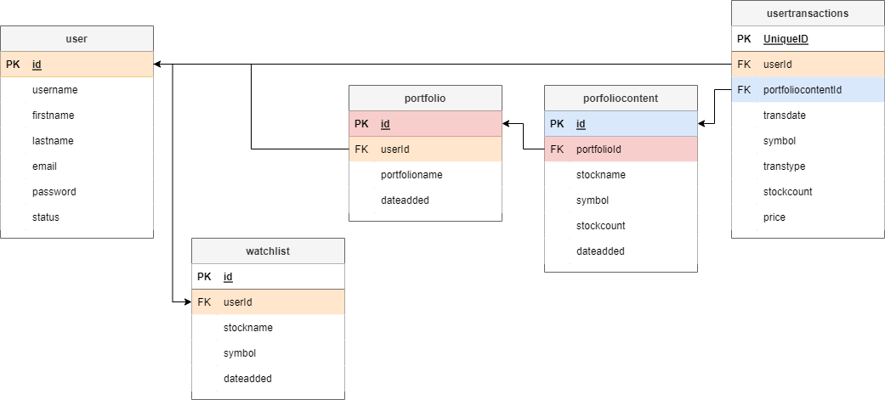
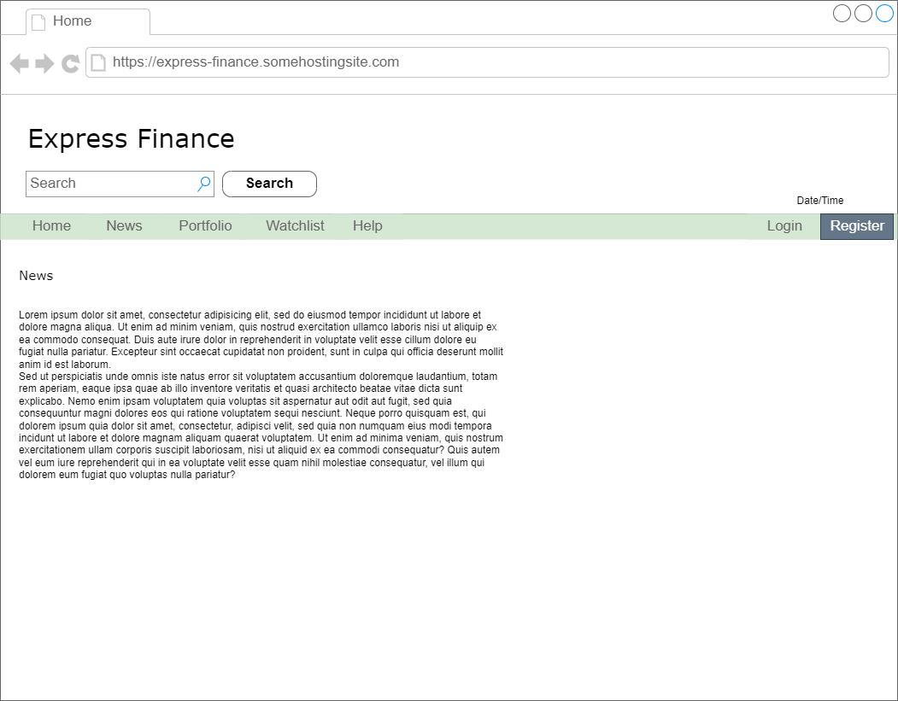
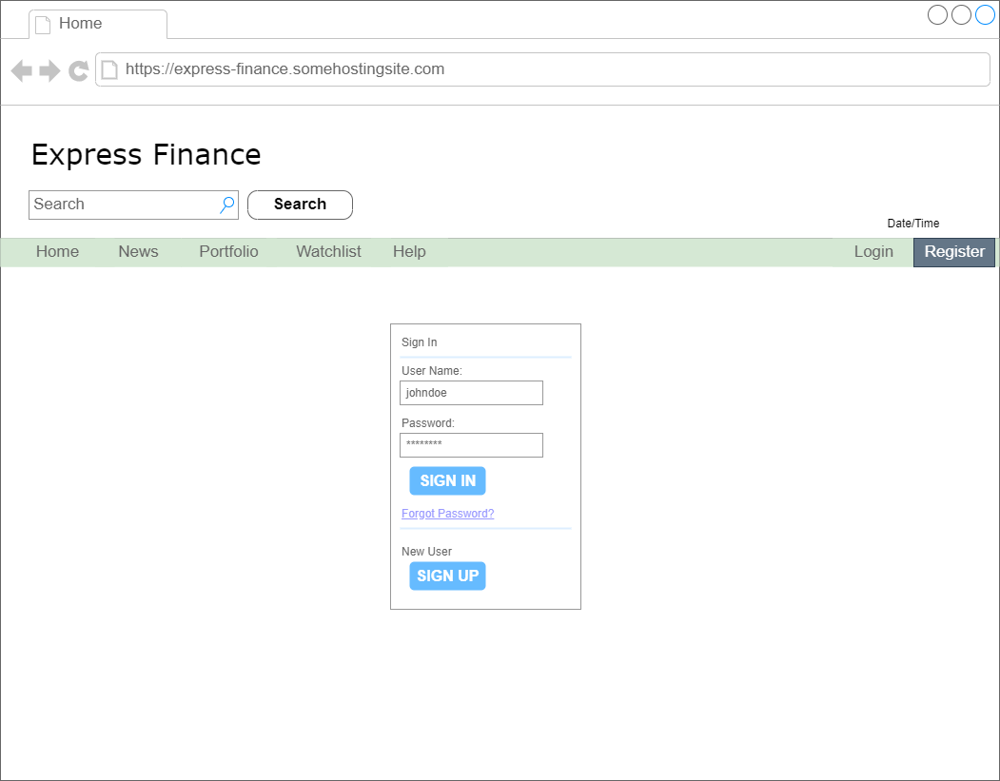
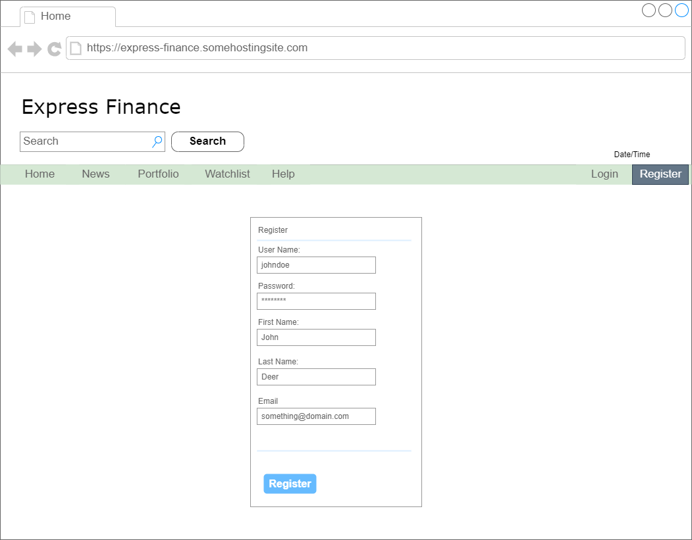
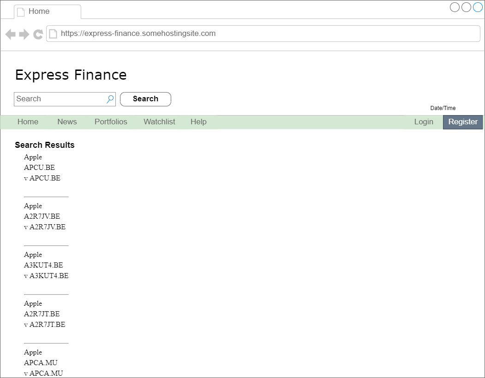
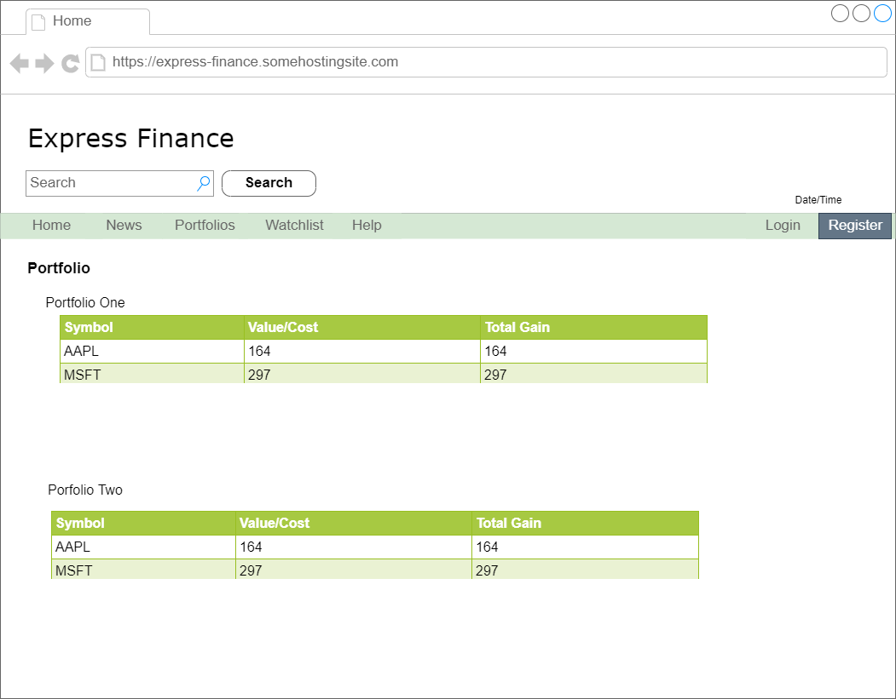
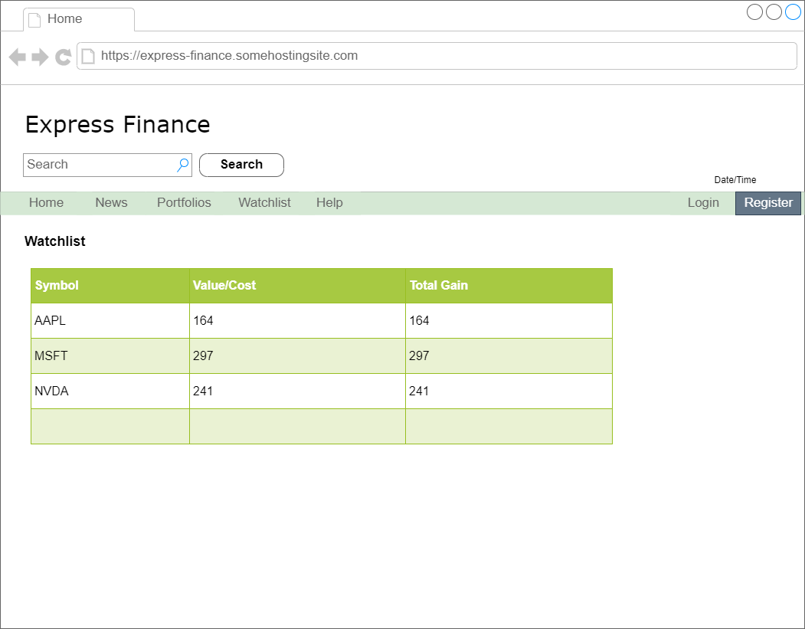
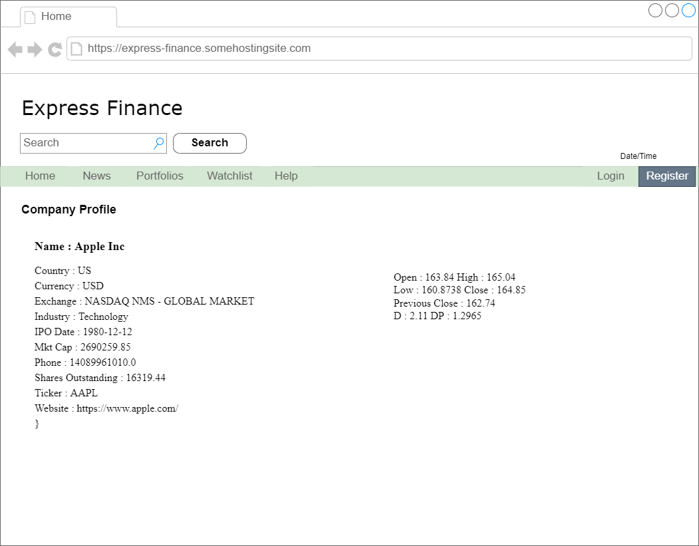
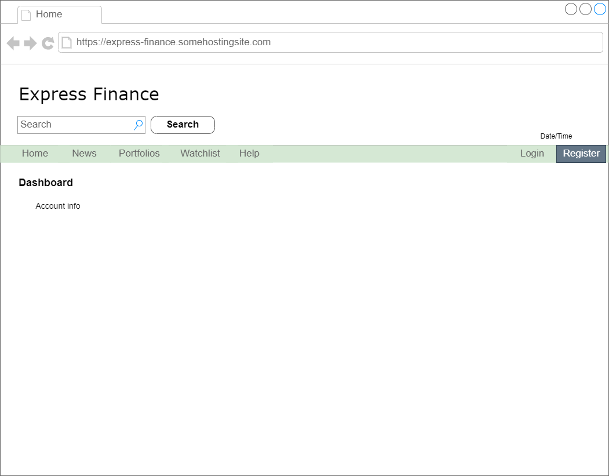

# Express Finance
This is my 2nd project for SEI bootcamp at General Assembly

## About the application
Web application for portfolio, tracking stocks, markets, and financial news. Real-Time stock, currencies and crypto information using Finnhub Stock API. The free API allows for access to several features like company news, basic financials, company earnings, crypto exchanges and symbols etc. Visit http://finnhub.io for more information.

## Features
*  Users can login and create a portfolio containing a list of stocks they own and view a snapshot of how their portfolio is  perfmorming.
*  Users can create a watchlist of stocks they are interested in.
*  User can read financial news about the company.

## Setting up the project
The application uses the following technologies/frameworks :
* axios
* node/express/ejs/express-ejs-layouts
* postgresql

Additional node packages are also needed :
* finnhub.js
* sequelize
* dotenv

Run `npm install` to install all dependencies

A free API key must be obtained from finnhub.io. This API key will be stored in the .env file. (Read `Changes` section at the bottom of the page.) 

## ERD

Table definitions :
##### user
| field name   | data type   | description   |
|---|---|---|
| id | serial_primary_key | primary key  |
| username | varchar(255)   | user generated user name. unique   |
| firstname | varchar(25)  | user first name   |
| lastname | varchar(25)   | user last name   |
| email| varchar(50)   | email address   |
| password | varchar(255) | user password   |
| status | varchar(1) | user status. active or disabled |

##### portfolio
| field name   | data type   | description   |
|---|---|---|
| id | serial_primary_key | primary key  |
| userId | foreign_key | linked to user table pk |
| portfolioname | varchar(50) | portfolio name |
|dateadded | date | creation date of portfolio |

##### portfoliocontent (renamed to `portofliodetail`)
| field name   | data type   | description   |
|---|---|---|
| id | serial_primary_key | primary key  |
| portfolioId | foreign_key | linked to portfolio table pk |
| stockname | varchar(255) | stock name |
| symbol | varchar(10) | stock symbol |
| stockcount | integer(8) | number of this stock in the portfolio (renamed to `stockcount`) |
| dateadded | date | date added to portfolio |

##### usertransactions
| field name   | data type   | description   |
|---|---|---|
| id | serial_primary_key | primary key  |
| userId | foreign_key | linked to user table pk |
| portofliocontentId | foreign_key | linked to portfoliocontentId table pk |
| transdate | date | transaction date |
| symbol | varchar(10) | stock symbol |
| transtype | varchar(1) | transaction type. buy or sell |
| stockcount | integer (8) | number of stocks bought or sold in the transaction (renamed to `quantity`)|
| price | double (changed to `decimal(10,2)`) | purchase price of stock |

##### watchlist
| field name   | data type   | description   |
|---|---|---|
| id | serial_primary_key | primary key  |
| userId | foreign_key | linked to user table pk |
| stockname | varchar(255) | stock name |
| symbol | varchar(10) |  stock symbol |
| dateadded |  date | date stock added to watchlist |

## RESTful Routing Chart
| Method   | Path   | Description   |
|---|---|---|
| GET | / | Home page |
| GET | /register | Registers a new account |
| POST | /login | Login page |
| GET | /lookup | Search stocks |
| GET | /results/:id | Displays results | 
| POST | /portfolio | create a new portofolio |
| POST | /portofolio/:id/usertransactions | Add stocks to portfolio `(modified)`|
| POST | /watchlist/:id | add stock to watchlist |
| GET | /company/id | display company profile |
| DELETE | /portofolio/:id | remove stock from portfolio (Changed. Deletes portfolio) |
| DELETE | /watchlist/:id | remove stock from watchlist |
| GET | /logout | logout |

## Application structure

#### Home page
* Displays financial news
* If user has not logged in, a `Login` and `Register` button/link will be displayed.
* If user is logged in, a `Logout` button/link will be displayed.

### Login page
* A `username` and `password` fields, and a submit button will be displayed. 
* A successful login will take them to their dashboard.

### Register page
* If the user has no account, they will be asked to register one.
* The following information will be required to create an account :

        1. Username (this will be used as for logins)
        2. First Name 
        3. Last Name
        4. Email address
        5. Password
* Once an account is successfuly created, they will be redirected to their dashboard.

### Dashboard
* The dashboard displays the user's account information, list of porfolios and watchlist.

### Portfolios page
* Displays the stocks in the portfolio.
* Shows information about how the stocks are performing.

### Watchlist page
* Displays the stocks in the user's watchlist.
* Shows information about how the stocks are performing.

### Search stocks
* This is tied to the search bar in the navigation. Any searches done will be displayed here.
* Buttons to add to `Portfolio`  or `Watchlist` will diplayed  beside the results.
* Links to each stock information will be available here.

### Company profile
* This will display the company's financial information as well as stock prices. 

### Other page elements

##### Header
* Contains website logo
* Search bar for stock prices

##### Navigation bar
* Menu for navigating the website. 
* Menu might inlcude links to the Home page, News page, Portfolio page, Dashboard, Login/Register, and Logout.
* Localized current date and time

## Wireframe

Home Page

Login page

Registration Page

Search results

Portfolio page

Watchhlist

Company Profile

User's dashboard

## User Stories
* As a user, I would like to be able to log in.
* As a user, I would like to be able to add stocks I currently own in a portfolio to be tracked.
* As a user, I woule like to be able to add stocks I am interested in a watchlist.

## MVP
1. Creation of registration and login page. All data will be stored in PostgresSql.
2. Search and save stocks to portfolio and/or watchlist.
3. Display stock prices.
4. Show performance of stocks in the portfolio.

## Stretch goals
1. Show real-time stock prices in company profile page. (Done)
2. Add a crypto portfolio.

## Progress
1. User can now register and login. User can logout and clear session.
2. User can create portfolios.
3. User can search stocks and add to portfolio.
4. News are published when clicking thet NEWS link in the navigation
5. Performance of each stock can be viewed in portfolio.
6. Watchlist contains current prices of stocks.
7. User can edit account details.

## Changes
1. Renamed table/model `portfoliocontent` to `portfoliodetail`
2. Renamed table/model `usertransactions` to `usertransaction`
3. Renamed column `portfoliocontentId` to `portfoliodetailsId` in `usertransaction` table/model.
4. Renamed column `stockcount` to `quantity` in `usertransaction` table/model.
5. Renamed column `stockcount` to `quantity` in `portfoliodetail` table/model.
6. Changed datatype of `price` in `usertransaction` table/model from `integer` to `decimal(10,2)`
7. Stocks will not be removed from porfolio. Instead, it will be closed after selling all.

## RESTful routes changes/additions

| Method   | Path   | Description   |
|---|---|---|
| POST | /portfolio/add | Adds a portofolio |
| GET | /portfolio/details/:id | Renders details.ejs. This is to list stocks in selected portfolio |
| GET | /portfolio/to?symbol | Renders addstock.ejs. Displays form for adding stock to a portfolio |
| POST | /portfolio/add_stock/?symbol | Adds stocks to portfolio |
| GET | /news | Renders news.ejs. Displays finance news |
| GET | /watchlist/addstock?symbol | Adds stock to watchlist. Page redirected to `/watchlist`. This is the page view of watchlist. |
| GET | /user | Opens account information with form to edit details. |
| PUT | /user | Updates account information. |
| DELETE | /portofolio/:id | remove stock from portfolio (Changed. Deletes portfolio) |
| POST | /portofolio/:id/usertransactions | Add stocks to portfolio `(modified)`|

## TO DO
- [x] Create watchlist table/model.
- [x] List stocks of a selected portfolio.
- [x] List stock of watchlist.
- [x] Display portfolio performance. 
- [x] Create company profile page. Shows news, stock quotes.

